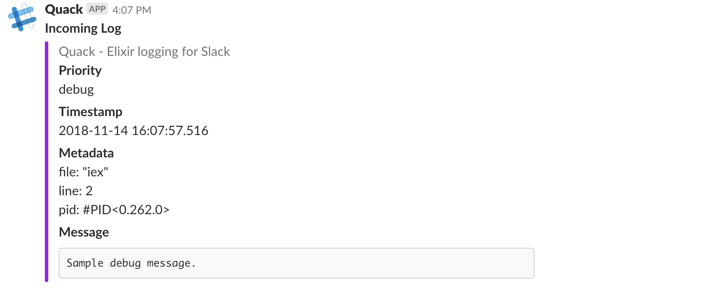
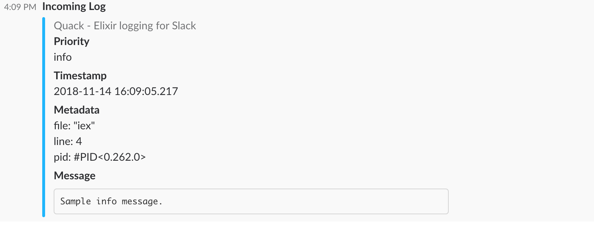
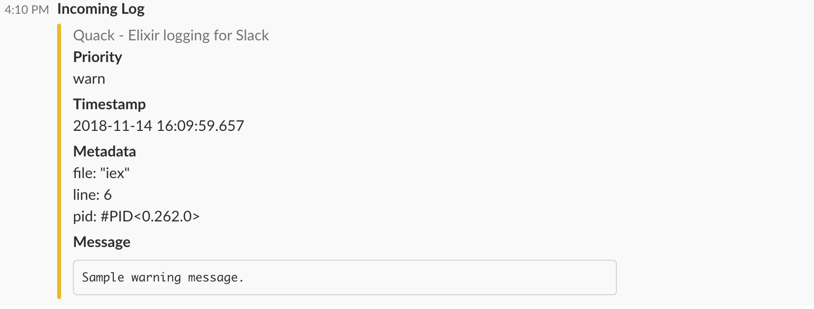

# Quack

[](https://hex.pm/packages/quack)
[](https://github.com/azohra/Quack/blob/master/LICENSE.md)

A simple, yet beautiful, Elixir Logger backend for Slack

## Installation

The package can be installed by adding `quack` to your list of dependencies in `mix.exs`:

```elixir
def deps do
  [
    {:quack, "~> 0.1.1"}
  ]
end
```

Then add Quack to your list of extra applications:

```elixir
  def application do
    [
      mod: {MyApplication, []},
      extra_applications: [:logger, :quack]
    ]
  end
```

## Configuration

Configure the Slack incoming webhook:

```elixir
  config :quack, webhook_url: "https://hooks.slack.com/services/...."
```

Configure your Logger application to use Quack as a backend:

```elixir
  config :logger, backends: [:console, Quack.Logger]
```

Configure the minimum-level of logs you want exported to Slack:

```elixir
  # Options are [:debug, :info, :warn, :error]
  config :quack, level: :debug
```

Configure which metadata you want to report on:

```elixir
  # You can specify a list of containing these fields: 
  #   [
  #     :application,
  #     :module,
  #     :function,
  #     :file,
  #     :line,
  #     :pid,
  #     :crash_reason,
  #     :initial_call,
  #     :registered_name
  #   ]

  config :quack, meta: [:file, :function, :line]

  # Or you can specify absolutes such as :all, or :none
  config :quack, meta: :none
```

The complete configuration should look something like this:

```elixir
  config :quack,
    level: :info,
    meta: [:file, :function, :line],
    webhook_url: "https://hooks.slack.com/services/..."

  config :logger, backends: [:console, Quack.Logger]
```

## Examples





